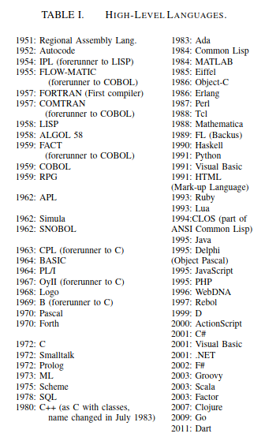
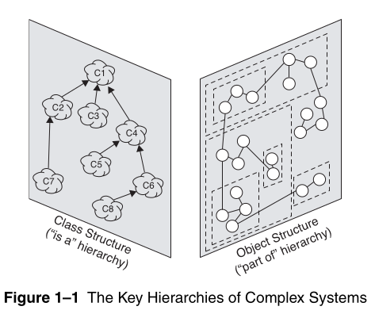
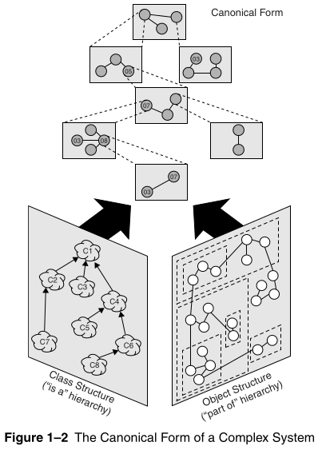

# Fundamentos del Diseño de Software II

---

<!-- @import "[TOC]" {cmd="toc" depthFrom=1 depthTo=4 orderedList=false} -->

<!-- code_chunk_output -->

- [Fundamentos del Diseño de Software II](#fundamentos-del-diseño-de-software-ii)
  - [Objetivo](#objetivo)
  - [1. Lenguajes de Programación](#1-lenguajes-de-programación)
    - [Interpretado vs Compilado](#interpretado-vs-compilado)
    - [Tipos de Lenguajes](#tipos-de-lenguajes)
  - [2. Evolución de los Lenguajes de Programación](#2-evolución-de-los-lenguajes-de-programación)
  - [3. Complejidad del Diseño de Software](#3-complejidad-del-diseño-de-software)
    - [Los 5 Atributos de un Sistema Complejo](#los-5-atributos-de-un-sistema-complejo)
    - [Complejidad Organizada y Desorganizada](#complejidad-organizada-y-desorganizada)
  - [4. Herramientas para el Manejo de la Complejidad en el Diseño de Software](#4-herramientas-para-el-manejo-de-la-complejidad-en-el-diseño-de-software)
  - [5. Paradigmas de Programación/Diseño de Software](#5-paradigmas-de-programacióndiseño-de-software)
  - [6. Conclusión](#6-conclusión)
  - [Referencias](#referencias)
      - [Libros](#libros)
    - [Guias](#guias)

<!-- /code_chunk_output -->

---

## Objetivo

Proporcionar a los estudiantes una comprensión profunda de la complejidad inherente al diseño de software y cómo manejarla eficazmente utilizando diversas herramientas y metodologías. Los estudiantes también explorarán la evolución de los lenguajes de programación y los paradigmas de programación que han surgido para abordar los desafíos del diseño de software. A través de esta lección, se busca que los estudiantes desarrollen la capacidad de aplicar principios de diseño y herramientas específicas para gestionar la complejidad en proyectos de software reales.

## 1. Lenguajes de Programación

### Interpretado vs Compilado

<table>
<tr>
    <th> Definición </th>
    <th> Tabla Comparativa </th>
</tr>
<tr>
<td>

</td>
<td>

</td>
</tr>
</table>

### Tipos de Lenguajes

[Types of Computer Language](https://www.educba.com/types-of-computer-language/)

  

[Programming](https://www.cs.princeton.edu/courses/archive/fall09/cos109/06langs.pdf)

  

[Evolution and History of Programming Languages](https://www.slideserve.com/hbosley/evolution-and-history-of-programming-languages-powerpoint-ppt-presentation)

## 2. Evolución de los Lenguajes de Programación

La evolución de los lenguajes de programación ha estado marcada por la necesidad de manejar la creciente complejidad en el desarrollo de software. Desde los primeros lenguajes de bajo nivel hasta los modernos lenguajes orientados a objetos y funcionales, cada etapa ha introducido características que permiten a los desarrolladores abordar problemas más complejos de manera más eficiente.

- **Lenguajes de Bajo Nivel:**
  - **Assembly:** Lenguaje muy cercano al lenguaje máquina, con un enfoque en la eficiencia y el control detallado del hardware.
  - **Fortran y COBOL:** Primeros lenguajes de alto nivel orientados a aplicaciones científicas y de negocios, respectivamente.

- **Lenguajes de Alto Nivel:**
  - **C:** Introdujo conceptos de programación estructurada y es la base de muchos lenguajes modernos.
  - **Java:** Un lenguaje orientado a objetos que introdujo la idea de "escribir una vez, ejecutar en cualquier lugar" con su Máquina Virtual Java (JVM).
  - **Python:** Lenguaje interpretado, conocido por su simplicidad y legibilidad, ampliamente utilizado en ciencia de datos, inteligencia artificial y desarrollo web.

- **Lenguajes Modernos:**
  - **Kotlin:** Un lenguaje moderno que se ejecuta en la JVM y mejora muchas de las limitaciones de Java, con una sintaxis más concisa y características como la nulabilidad controlada.
  - **Rust:** Un lenguaje de sistemas que prioriza la seguridad y el rendimiento, evitando errores comunes como punteros nulos y condiciones de carrera.

## 3. Complejidad del Diseño de Software

El diseño de software es una tarea intrínsecamente compleja, ya que implica la creación de sistemas que deben satisfacer múltiples requisitos, ser escalables, mantenibles y eficientes. La complejidad en el diseño de software puede manifestarse en varias formas:

- **Complejidad Accidental vs. Complejidad Esencial:**
  - **Complejidad Esencial:** Se refiere a la dificultad inherente al problema que el software está destinado a resolver. No se puede eliminar, pero se puede gestionar mediante un buen diseño.
  - **Complejidad Accidental:** Surge de la solución implementada, incluyendo malas decisiones de diseño, uso ineficaz de herramientas, o tecnologías inapropiadas. Esta complejidad puede minimizarse o eliminarse con prácticas de diseño adecuadas.

- **Factores que contribuyen a la complejidad:**
  - **Requisitos cambiantes:** Las necesidades de los usuarios y del negocio pueden evolucionar, aumentando la complejidad del software.
  - **Interacción de componentes:** La interdependencia entre distintos módulos y servicios puede complicar el diseño.
  - **Escalabilidad y rendimiento:** Diseñar software que sea eficiente y escalable introduce desafíos adicionales.
  - **Mantenibilidad:** El software debe ser fácil de modificar, corregir y mejorar sin introducir errores.

¡Nuestro objetivo es ver que parece fácil!

  

>[!IMPORTANT]
>En ciencias de la computaci´on definiremos **mantenimiento** cuando corregimos errores, **evolución** cuando respondemos a requisitos cambiantes, y **preservación** cuando seguimos utilizando medios extraordinarios para mantener en funcionamiento un software antiguo y decadente.

### Los 5 Atributos de un Sistema Complejo 

- **Estructura Jerarquía**

  

    
  

  >*Con frecuencia, la complejidad adopta la forma de una jerarquía, según la cual un sistema complejo se compone de subsistemas interrelacionados que a su vez tienen sus propios subsistemas, y así sucesivamente, hasta llegar a algún nivel inferior de componentes elementales.*

- **Primitivos Relativos**

  >*La elección de los componentes primitivos de un sistema es relativamente arbitraria y depende en gran medida del criterio del observador del sistema.*

- **Separación de Preocupaciones/Intereses**

  >*Los vínculos intracomponentes suelen ser más fuertes que los intercomponentes. Este hecho tiene el efecto de separar la dinámica de alta frecuencia de los componentes -que implica la estructura interna de los componentes- de la dinámica de baja frecuencia -que implica la interacción entre los componentes.*

- **Patrones Comunes**
  >*Los sistemas jerárquicos suelen estar compuestos por unos pocos tipos de subsistemas en diversas combinaciones y disposiciones.*

- **Formas Intermedias Estables**
  >*Un sistema complejo que funciona evoluciona invariablemente a partir de un sistema simple que funcionaba. . . . Un sistema complejo diseñado desde cero nunca funciona y no se puede parchear para que funcione. Hay que empezar de nuevo, partiendo de un sistema simple que funcione.*

### Complejidad Organizada y Desorganizada

    

    
  

## 4. Herramientas para el Manejo de la Complejidad en el Diseño de Software

Para manejar la complejidad en el diseño de software, se pueden utilizar diversas herramientas y metodologías:

- **Principios de Diseño:**
  - **Modularidad:** Dividir el sistema en módulos independientes que pueden desarrollarse, probarse y mantenerse por separado.
  - **Separación de Responsabilidades:** Asegurar que cada módulo tenga una única responsabilidad o función dentro del sistema.
  - **Principio de Abierto/Cerrado (OCP):** El diseño debe estar abierto a la extensión, pero cerrado a la modificación, permitiendo agregar nuevas funcionalidades sin alterar el código existente.
  - **Principio de Sustitución de Liskov (LSP):** Los objetos de una clase derivada deben poder sustituir objetos de la clase base sin alterar el correcto funcionamiento del programa.
  - **Principio de Inversión de Dependencia (DIP):** Los módulos de alto nivel no deben depender de módulos de bajo nivel, sino de abstracciones.

- **Patrones de Diseño:**
  - **Patrón Singleton:** Garantiza que una clase tenga solo una instancia y proporciona un punto de acceso global a esa instancia.
  - **Patrón Factory:** Define una interfaz para crear un objeto, pero permite a las subclases alterar el tipo de objetos que se crearán.
  - **Patrón Observer:** Define una dependencia uno-a-muchos entre objetos, de modo que cuando un objeto cambia su estado, todos sus dependientes son notificados y actualizados automáticamente.

- **Herramientas de Modelado:**
  - **UML (Unified Modeling Language):** Un lenguaje estándar para visualizar, especificar, construir y documentar los artefactos de un sistema de software.
  - **IDE (Integrated Development Environment):** Herramientas como IntelliJ IDEA, Eclipse o Visual Studio que proporcionan funcionalidades avanzadas para el desarrollo y diseño de software.
  - **Version Control Systems (VCS):** Git es una herramienta fundamental para gestionar versiones del software, facilitando el trabajo en equipo y la trazabilidad de cambios.

- **Técnicas de Refactorización:**
  - **Refactorización:** El proceso de mejorar el diseño de código existente sin cambiar su comportamiento externo. Ejemplos incluyen la extracción de métodos, eliminación de duplicaciones y mejora de nombres de variables y métodos.

## 5. Paradigmas de Programación/Diseño de Software

Los paradigmas de programación son estilos o enfoques que guían el diseño y la estructura del código. Cada paradigma tiene sus propias fortalezas y es adecuado para ciertos tipos de problemas.

- **Programación Estructurada:**
  - Enfatiza el uso de secuencias, bucles y condicionales. Ejemplos incluyen lenguajes como C y Pascal.

- **Programación Orientada a Objetos (POO):**
  - Se basa en la creación de objetos que interactúan entre sí. Los lenguajes como Java, C++, y Python son representativos de este paradigma.

- **Programación Funcional:**
  - Enfatiza la inmutabilidad y el uso de funciones puras (sin efectos secundarios). Ejemplos incluyen Haskell, Scala, y el enfoque funcional en lenguajes como JavaScript y Python.

- **Programación Reactiva:**
  - Se centra en la programación basada en eventos y la gestión de flujos de datos asíncronos. Ejemplos incluyen RxJava y React.js en el ámbito de desarrollo web.

- **Programación Orientada a Aspectos:**
  - Facilita la separación de preocupaciones transversales como el registro de logs, la gestión de transacciones y la seguridad. AspectJ es un ejemplo de implementación de este paradigma.

[Programming Language Categories](https://medium.com/@jepozdemir/programming-language-categories-6b786d70e8f7)

## 6. Conclusión

La complejidad en el diseño de software es un desafío central en el desarrollo de sistemas modernos. A lo largo de esta clase, hemos examinado cómo manejar esta complejidad utilizando principios de diseño, patrones, y herramientas especializadas. También discutimos cómo la evolución de los lenguajes de programación y los distintos paradigmas de programación han permitido a los desarrolladores abordar problemas de manera más efectiva, facilitando la creación de software modular, escalable y mantenible.

En resumen, el dominio del diseño de software requiere una comprensión profunda de las herramientas y metodologías disponibles, así como la habilidad para aplicarlas en contextos reales. Los conceptos y enfoques explorados en esta clase son esenciales para que los estudiantes enfrenten con éxito los desafíos que surgen en proyectos de software complejos, permitiéndoles construir soluciones robustas y sostenibles.

## Referencias

#### Libros
  - Erich Gamma, Richard Helm, Ralph Johnson, y John Vlissides. *Design Patterns: Elements of Reusable Object-Oriented Software.*.
  - Grady Booch, Robert A. Maksimchuk, Michael W. Engel, Bobbi J. Young, Jim Conallen, Kelli A. Houston. *Object-oriented analysis and design with applications.* Addison-Wesley 2007, 3ra edición.
  - [On the Evolution of Programming Languages](https://arxiv.org/pdf/2007.02699)

### Guias 

  - [COS 301 - 2018UMaine School of Computing and Information Science - Evolution of the Major - Programming Languages](http://mainesail.umcs.maine.edu/COS301/schedule/slides/02-evolution-slides.pdf)
