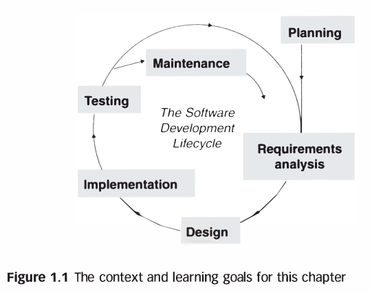
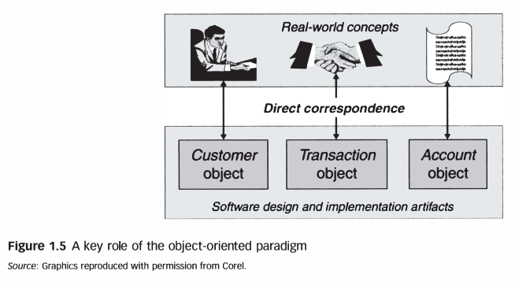

# Ingeniería de Software

---


<!-- @import "[TOC]" {cmd="toc" depthFrom=1 depthTo=6 orderedList=false} -->

<!-- code_chunk_output -->

- [Ingeniería de Software](#ingeniería-de-software)
  - [Objetivo](#objetivo)
  - [1. Definición de Ingeniería de Software](#1-definición-de-ingeniería-de-software)
    - [Características Clave](#características-clave)
    - [Principios](#principios)
  - [2. Principales Problemas en Ingeniería de Software](#2-principales-problemas-en-ingeniería-de-software)
  - [3. Ciclo de Vida del Software](#3-ciclo-de-vida-del-software)
    - [Modelos de Ciclo de Vida](#modelos-de-ciclo-de-vida)
  - [Ejemplo POO](#ejemplo-poo)
  - [Conclusión](#conclusión)
  - [Referencias](#referencias)
      - [Libros](#libros)
      - [Videos](#videos)
      - [Guias y Tutoriales](#guias-y-tutoriales)

<!-- /code_chunk_output -->

---


## Objetivo 

Introducir a los estudiantes en los fundamentos de la ingeniería de software, proporcionando una comprensión clara de su definición, los principales problemas que enfrenta la disciplina, y el ciclo de vida del software. Los estudiantes aprenderán cómo estos elementos interactúan en la práctica del desarrollo de software y cómo aplicarlos en proyectos reales para producir software de alta calidad y sostenible.

## 1. Definición de Ingeniería de Software

La ingeniería de software es una disciplina que abarca un conjunto de metodologías, herramientas, y prácticas destinadas a la creación, mantenimiento, y gestión de sistemas de software de manera sistemática, disciplinada y cuantificable. A diferencia de la simple programación, la ingeniería de software se enfoca en todo el proceso de desarrollo, desde la concepción de la idea hasta el mantenimiento del software una vez que está en producción.

### Características Clave
  - **Sistemática:** Uso de métodos organizados y planificados en el desarrollo de software.
  - **Cuantificable:** Medición y control de los procesos y productos del software.
  - **Disciplina:** Aplicación de principios y normas para garantizar la calidad y consistencia.

  ```java
  // Ejemplo básico de un proceso sistemático
  public class SoftwareDevelopment {
      public static void main(String[] args) {
          String[] etapas = {"Requisitos", "Diseño", "Implementación", "Pruebas", "Mantenimiento"};
          for (String etapa : etapas) {
              System.out.println("Etapa: " + etapa);
          }
      }
  }
  ```

### Principios


<div align="center">
    
</div>


## 2. Principales Problemas en Ingeniería de Software

Desarrollar software a gran escala presenta varios desafíos, entre los que se destacan:

- **Gestión de Requisitos:**
  - Los requisitos del software suelen cambiar a lo largo del tiempo, lo que puede complicar el proceso de desarrollo. La gestión efectiva de estos cambios es crucial para el éxito del proyecto.

- **Calidad del Software:**
  - Asegurar que el software cumpla con los estándares de calidad en términos de funcionalidad, rendimiento, seguridad y usabilidad es uno de los mayores retos en la ingeniería de software.

- **Costos y Plazos:**
  - Los proyectos de software a menudo enfrentan presiones de tiempo y presupuesto. La mala estimación y la falta de planificación pueden llevar a sobrecostos y retrasos significativos.

- **Mantenimiento:**
  - El software requiere actualizaciones y correcciones constantes, lo que a menudo consume más recursos que el desarrollo inicial. Mantener el software limpio y bien documentado es esencial para facilitar su mantenimiento.


## 3. Ciclo de Vida del Software

El ciclo de vida del software describe las etapas a través de las cuales el software pasa desde su concepción hasta su retiro. Cada modelo de ciclo de vida ofrece un enfoque diferente para la gestión de estas etapas.


<div align="center">
    
</div>


### Modelos de Ciclo de Vida
  - **Modelo en Cascada:** Un enfoque secuencial donde cada fase debe completarse antes de comenzar la siguiente. Es adecuado para proyectos con requisitos bien definidos desde el inicio.
  
  <div align="center">
    
  </div>

  [5.1. Ciclo de vida clásico o en cascada](https://edea.juntadeandalucia.es/bancorecursos/file/00bf7c9d-90e4-4665-b6c5-09c91749a989/1/es-an_2017022012_9122843.zip/51_ciclo_de_vida_clsico_o_en_cascada.html?temp.hn=true&temp.hb=true)

  <div align="center">
    
  </div>

  [What is the Waterfall software development methodology and is it still relevant?](https://kruschecompany.com/waterfall-software-development-methodology/)
  

  - **Modelo Iterativo:** Permite la repetición de fases y es ideal para proyectos donde los requisitos no están completamente definidos desde el principio.
  
  ```java
  // Ejemplo simplificado de una iteración en un ciclo de vida ágil
  public class IteracionAgil {
      public static void main(String[] args) {
          for (int i = 1; i <= 3; i++) {
              System.out.println("Iteración " + i + ": Planificación, Desarrollo, Pruebas, Revisión.");
          }
      }
  }
  ```

  - **Modelo Ágil:** Un enfoque iterativo e incremental que enfatiza la colaboración del equipo, la flexibilidad y la entrega continua de valor al cliente. Es especialmente útil en entornos dinámicos y con cambios frecuentes en los requisitos.

## Ejemplo POO

<div align="center">
    
</div>

## Conclusión

La ingeniería de software es una disciplina fundamental para el desarrollo de sistemas complejos y escalables. A través de esta clase, los estudiantes han explorado la definición, los principales problemas, y el ciclo de vida del software, comprendiendo cómo estos elementos se integran en la práctica del desarrollo de software. El ejercicio práctico proporcionó una oportunidad para aplicar estos conceptos en un proyecto real, reforzando la importancia de un enfoque sistemático y disciplinado en la creación de software de calidad.


## Referencias

#### Libros
- Eric J. Braude, Michael E. Bernstein. *SOFTWARE ENGINEERING Modern Approaches*, Second Edition 2011.

#### Videos
- [20 System Design Concepts Explained in 10 Minutes ](https://www.youtube.com/watch?v=i53Gi_K3o7I)


#### Guias y Tutoriales

- [software-engineering](https://github.com/floe/software-engineering/tree/master)
- [Software & Software Engineering](https://www.se.rit.edu/~se361/Slides/se361_Chapter_01.pdf)
- [Software Engineering PPT](https://calicut-university.teachics.org/teaching-presentations/software-engineering-ppt/)
